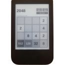
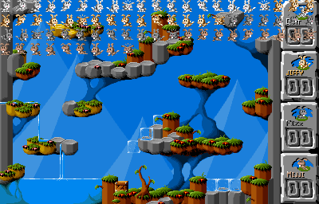
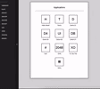
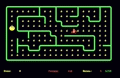

<table align="left">
  <tr>
    <td align="center" valign="middle" height="150">
      
    </td>
  </tr>
  <tr>
    <td align="center" valign="top">
      <em>Competitive programming</em>
    </td>
  </tr>
  <tr>
    <td align="center" valign="middle">
      <a href="https://github.com/esix/competitive-programming">Source</a>
    </td>
  </tr>
</table>
<table align="left">
  <tr>
    <td align="center" valign="middle" height="150">
      
    </td>
  </tr>
  <tr>
    <td align="center" valign="top">
      <em>15 puzzle CSS-only</em>
    </td>
  </tr>
  <tr>
    <td align="center" valign="middle">
      <a href="https://github.com/esix/esix.github.io/tree/master/source/demo/15">Source</a> &middot; <a href="https://esix.github.io/demo/15/">Demo</a>
    </td>
  </tr>
</table>
<table align="left">
  <tr>
    <td align="center" valign="middle" height="150">
      
    </td>
  </tr>
  <tr>
    <td align="center" valign="top">
      <em>2048 game for PocketBook device</em>
    </td>
  </tr>
  <tr>
    <td align="center" valign="middle">
      <a href="https://github.com/esix/2048-pocketbook">Source</a>
    </td>
  </tr>
</table>
<table align="left">
  <tr>
    <td align="center" valign="middle" height="150">
      
    </td>
  </tr>
  <tr>
    <td align="center" valign="top">
      <em>Client-server Jump'n Bump port (JS, PHP)</em>
    </td>
  </tr>
  <tr>
    <td align="center" valign="middle">
      <a href="https://github.com/esix/jump-n-bump">Source</a>
    </td>
  </tr>
</table>
<table align="left">
  <tr>
    <td align="center" valign="middle" height="150">
      
    </td>
  </tr>
  <tr>
    <td align="center" valign="top">
      <em>PocketBook simulator in browser (wasm)</em>
    </td>
  </tr>
  <tr>
    <td align="center" valign="middle">
      <a href="https://github.com/esix/pocketbook-simulator">Source</a> &middot; <a href="https://esix.github.io/demo/pocketbook-simulator/">Demo</a>
    </td>
  </tr>
</table>
<table align="left">
  <tr>
    <td align="center" valign="middle" height="150">
      
    </td>
  </tr>
  <tr>
    <td align="center" valign="top">
      <em>Pac-Man JavaScript clone</em>
    </td>
  </tr>
  <tr>
    <td align="center" valign="middle">
      <a href="https://github.com/esix/packman">Source</a> &middot; <a href="https://esix.github.io/demo/packman/">Demo</a>
    </td>
  </tr>
</table>
 
